# Press-A-Button Voice Typing on Ubuntu (KDE Plasma / Wayland)

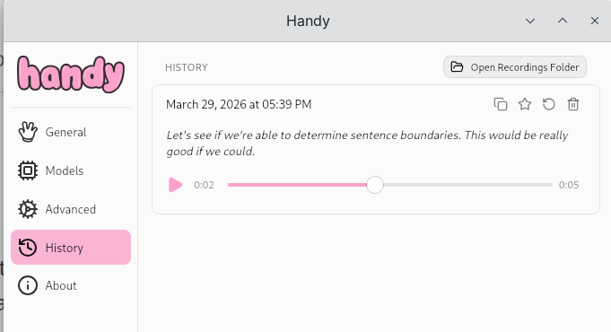

A guide to setting up one-press voice typing on Ubuntu 25.10 with KDE Plasma on Wayland using [Handy](https://github.com/cjpais/Handy) (a local speech-to-text tool) combined with a USB macro button or foot pedal and [Input Remapper](https://github.com/sezanzeb/input-remapper).

The end result: press a physical button, speak, and your words appear as typed text wherever your cursor is.

**[Download the full setup manual (PDF)](manual.pdf)**

## Why This Guide Exists

Handy works well out of the box on X11, but getting it running smoothly on **KDE Plasma + Wayland** required a few non-obvious workarounds:

- The **overlay had to be disabled** — with it enabled, typed output wouldn't reach the active window.
- **ydotool had to be manually selected** as the typing tool — the default input method doesn't work on Wayland.
- **The trigger-key story is messier than you'd expect.** My personal preference — and what I'd still recommend as the ideal trigger — is **`F13`**: it's not physically present on nearly any keyboard, so emitting it from a USB macro button / foot pedal is guaranteed conflict-free. But as of the date this guide was last validated, Handy's shortcut library refuses to register it (`Unknown scancode for key: F13`), and bare single keys like `Pause` on KDE Wayland can silently fail to fire through the XDG GlobalShortcuts portal. So the **second-best validated workaround** is `Ctrl+Alt+Space` — a modifier combo tauri accepts and KDE doesn't claim. Input Remapper emits that combo from the USB button press.
- **Do not switch `keyboard_implementation` to `handy_keys`** (the evdev backend). On this setup it grabs keystrokes and re-injects them through ydotool, causing a runaway loop that floods every focused window with garbage text. Stay on the default `tauri` implementation.

If you're on X11, you may not need all of these steps. But if you're on Wayland (which is the default on modern Ubuntu + KDE), this guide should save you some troubleshooting.

## Validated Working Configuration (2026-04-14)

The exact setup confirmed working end-to-end — button press → recording → transcription → text appears at the cursor — on Ubuntu 25.10, KDE Plasma 6, Wayland:

**Handy** (`~/.local/share/com.pais.handy/settings_store.json`):

| Setting | Value |
|---|---|
| `transcribe` binding | `ctrl+alt+space` |
| `keyboard_implementation` | `tauri` |
| `paste_method` | `direct` |
| `typing_tool` | `ydotool` |
| `clipboard_handling` | `copy_to_clipboard` |
| `overlay_position` | `none` |
| `push_to_talk` | `false` |
| `selected_model` | `parakeet-tdt-0.6b-v3` |

**Input Remapper** — Output field for the USB button:

```
Control_L + Alt_L + space
```

**ydotool** — `ydotoold` daemon running (system service), socket at `/tmp/.ydotool_socket`.

## Overview

The setup has three parts:

1. **Hardware** - A USB macro key, macro pad, or foot pedal that registers as a HID device
2. **Input Remapper** - Maps the button press to `Ctrl+Alt+Space` (a combo Handy's shortcut system accepts reliably on KDE Wayland)
3. **Handy** - Listens for that shortcut and toggles voice transcription, typing the result directly into the active window via ydotool

## Hardware

Any programmable USB HID device will work. Options include:

- **Single USB macro button** - The simplest option. A single large button that sends one keycode. Works well with Handy's toggle-to-transcribe shortcut. Available cheaply on Amazon and AliExpress.
- **USB foot pedal** (1-3 keys) - Hands-free operation, great if you're typing and dictating simultaneously.
- **USB macro pad** (3+ buttons) - The most flexible option. With multiple buttons you can assign separate shortcuts for start, stop, and push-to-talk rather than relying on a single toggle. This gives you more control over the transcription workflow.

The device just needs to show up as a HID input device on Linux. No special drivers required.

### Hardware Examples


*Single USB macro button — the simplest option*


*USB macro buttons available on AliExpress*


*USB foot pedals — hands-free voice typing*


*USB foot pedals on AliExpress*


*USB macro pads on AliExpress — multi-button option*

## Setup

### 1. Install Handy

Install Handy from its repository or package. It runs as a background app with a system tray icon.

### 2. Configure Handy

#### General Settings

- **Transcribe Shortcut**: Set to `Ctrl+Alt+Space`. Modifier combos register reliably through the XDG portal; bare single keys (F13, Pause, media keys) are hit-and-miss on KDE Wayland.
- **Microphone**: Select your preferred mic.
- **Audio Feedback**: Enable for an audible cue when transcription starts/stops.

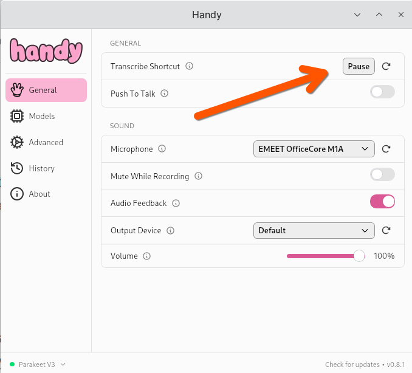
*Screenshot from an earlier iteration showing `Pause`. Use `Ctrl+Alt+Space` instead — `Pause` can silently fail to register on KDE Wayland.*

#### Models

Choose a transcription model. **Parakeet V3** offers a good balance of accuracy and speed with multi-language support. Other options include Moonshine Base (fast, English only), Whisper variants (various sizes), and Canary models.

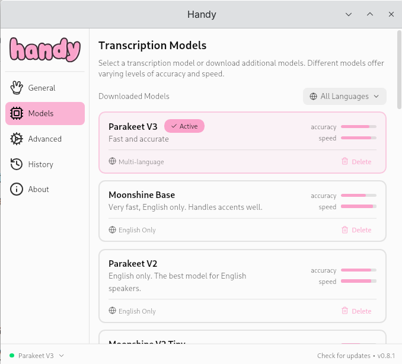
*Available transcription models (Parakeet V3, Moonshine Base, Parakeet V2)*

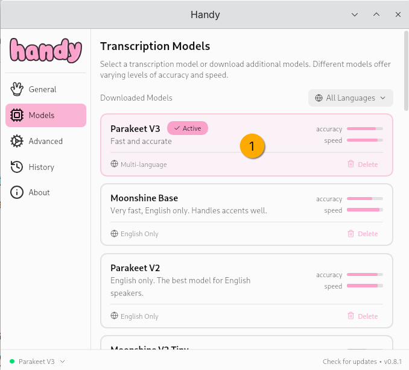
*Parakeet V3 selected as the active model*

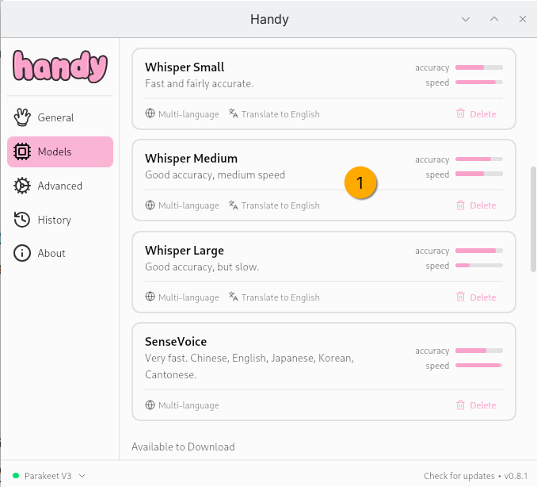
*Additional models: Whisper Small/Medium/Large, SenseVoice*

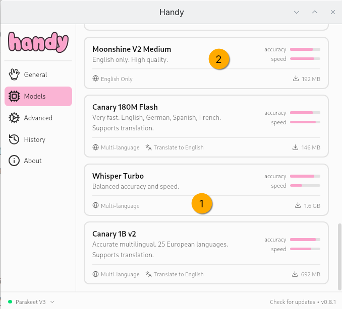
*More models: Moonshine V2 Medium, Canary 180M Flash, Whisper Turbo, Canary 1B v2*

#### Advanced Settings

Key settings for a smooth experience:

| Setting | Recommended Value | Why |
|---|---|---|
| **Start Hidden** | On | Runs quietly in the background |
| **Launch on Startup** | On | Always available |
| **Show Tray Icon** | On | Easy access to settings |
| **Overlay Position** | None | **Required on Wayland** — with overlay enabled, typed output doesn't reach the active window |
| **Unload Model** | Never | Keeps the model in RAM for instant response |
| **Paste Method** | Direct | Types directly into the active window |
| **Typing Tool** | ydotool | **Required on Wayland** — the default typing method does not work under Wayland; must be set manually |
| **Clipboard Handling** | Copy to Clipboard | Transcription text also lands on the clipboard as a fallback. Switch to "Don't Modify" if preserving clipboard is more important to you. |
| **History Limit** | 1 entry | Saves disk space |
| **Auto-Delete Recordings** | Keep latest 1 | Privacy-friendly |

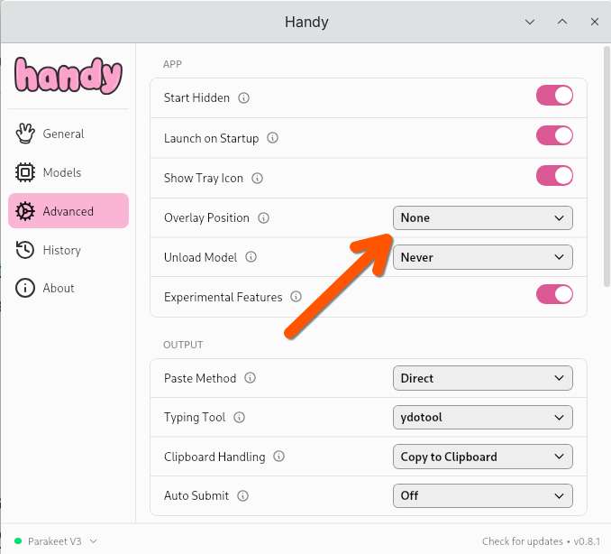
*Advanced settings overview — note Overlay Position set to None and Typing Tool set to ydotool*

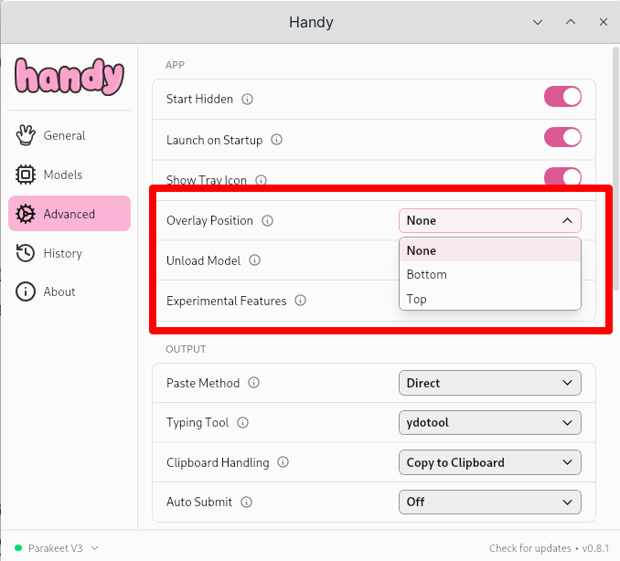
*Overlay Position dropdown — select None for Wayland compatibility*

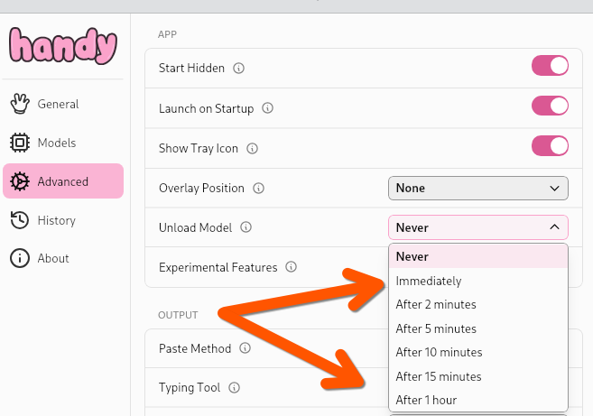
*Unload Model dropdown — set to Never for instant response*

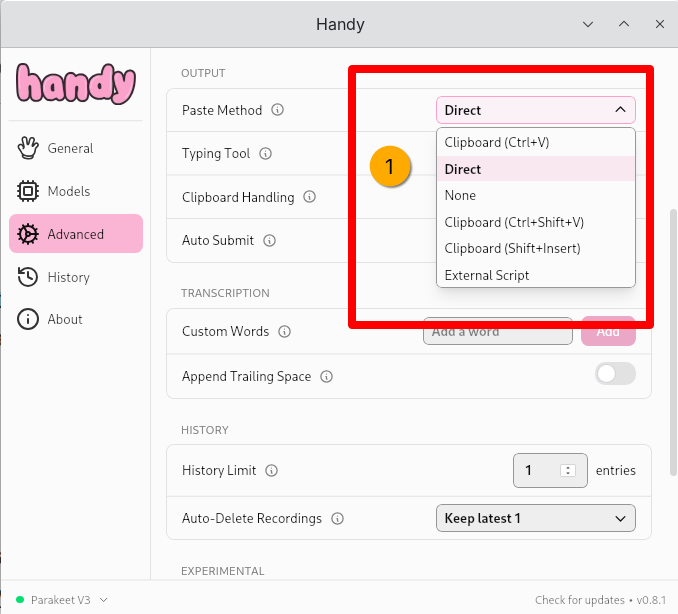
*Paste Method dropdown — select Direct for Wayland*

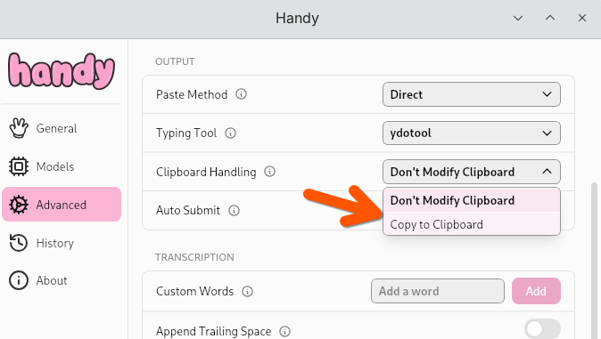
*Clipboard Handling — select Don't Modify Clipboard*

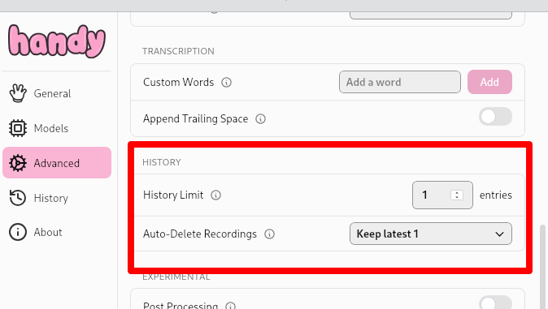
*History settings — limit to 1 entry, keep latest 1 recording*

### 3. Install Input Remapper

```bash
sudo apt install input-remapper
```

### 4. Configure Input Remapper

1. Open Input Remapper
2. Find your USB device in the **Devices** tab (it will show up by its HID identifier, e.g., `HID 5131:2019`)
3. Go to the **Presets** tab and create a new preset (e.g., "USB Voice Typing Trigger")
4. In the **Editor** tab:
   - Record the input from your button (click **Record**, then press the button)
   - Set the output type to **Key or Macro**
   - Set the target to **keyboard**
   - In the Output field, enter exactly: `Control_L + Alt_L + space`
   - **Why a combo, not a single key**: `KEY_F13` would be the ideal single key (it's not on any physical keyboard so can't conflict with anything), but Handy's shortcut library currently rejects it. Single keys like `KEY_PAUSE` can silently fail to fire on KDE Wayland. A `Ctrl+Alt+Space` combo goes through the XDG portal cleanly and has been validated end-to-end.
5. Enable **Autoload** so the mapping persists across reboots
6. Click **Apply**

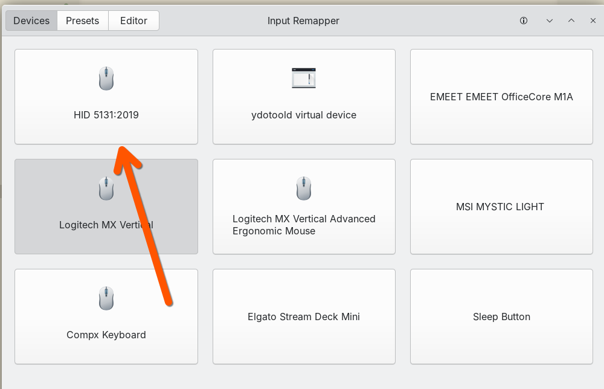
*Devices tab — select your USB HID device (e.g., HID 5131:2019)*

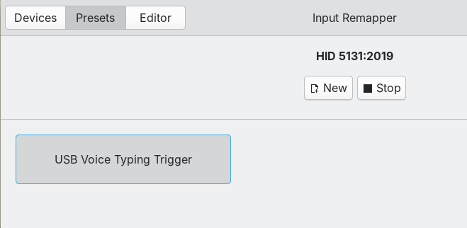
*Presets tab — create a preset named "USB Voice Typing Trigger"*

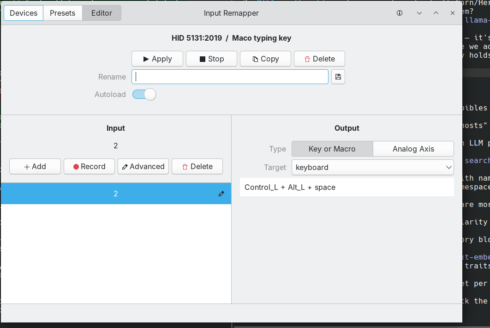
*Editor tab — button mapped to `Control_L + Alt_L + space` with Autoload enabled. This is the validated working mapping.*

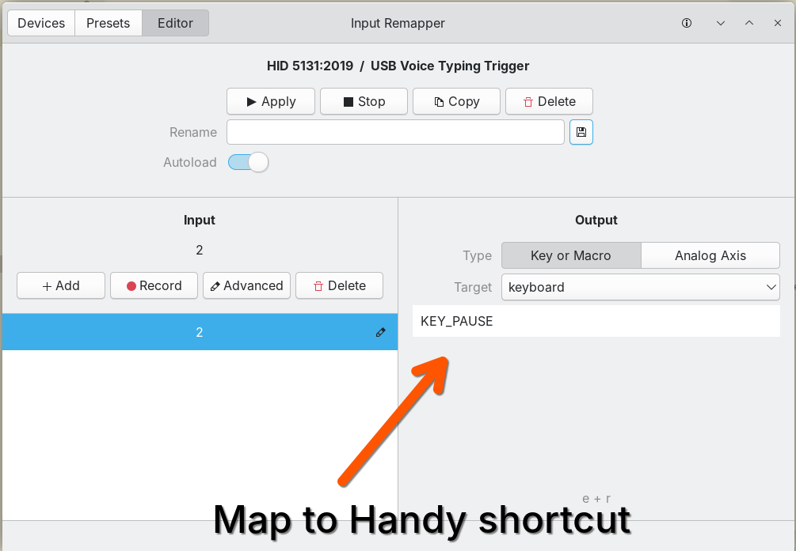
*Earlier iteration showing `KEY_PAUSE` — kept for reference. Use the `Control_L + Alt_L + space` mapping above instead.*

### Single Button vs Multi-Button Devices

With a **single button**, you use Handy's toggle mode: press once to start transcribing, press again to stop. Simple and effective.

With a **macro pad (3+ buttons)**, you can assign separate shortcuts for:
- **Start** transcription
- **Stop** transcription
- **Push-to-talk** (hold to record, release to stop)

This gives finer control and avoids accidentally toggling into the wrong state.

## Result

Once configured, the workflow is:

1. Handy launches silently at boot and loads the transcription model into memory
2. Input Remapper loads at boot and maps your USB device
3. Place your cursor in any text field
4. Press your button and speak
5. Text appears where your cursor is


*Example transcription result shown in Handy's History view*

## Wayland Troubleshooting

If transcription runs but no text appears in your application:

1. **Disable the overlay** — set Overlay Position to `None` in Handy's Advanced settings
2. **Set Typing Tool to ydotool** — the default doesn't work on Wayland
3. **Ensure ydotool is installed and its daemon is running** — `sudo apt install ydotool` and check that `ydotoold` is active. The daemon's default socket is `/tmp/.ydotool_socket`; if you've set `YDOTOOL_SOCKET` in your shell rc files, make sure it points at a socket that actually exists.
4. **Set Paste Method to Direct** — clipboard-based paste methods can be unreliable under Wayland

If pressing the hotkey does nothing at all (no Marimba sound, no log entry for the press):

- Check `~/.local/share/com.pais.handy/logs/handy.log` for `register_tauri_shortcut registration error`. `Unknown scancode for key: F13` means Handy's library doesn't know that key — use a modifier combo instead.
- Avoid bare single keys like `Pause`, `ScrollLock`, `Insert`, or media keys on KDE Wayland. They may log as "registered" but never fire because the XDG portal doesn't route them. A `Ctrl+Alt+Space`-style combo is the reliable fix.
- **Do not flip `keyboard_implementation` to `handy_keys`.** On this setup it causes a keystroke injection loop that floods whatever window has focus.
- `SIGUSR1` to the Handy process is not a reliable substitute for the hotkey — the signal is received but the handler does not reliably trigger a recording.

## GPU Acceleration (AMD)

This setup was tested on an **AMD Radeon RX 7800 XT** (Navi 32, 12 GB VRAM) with ROCm. Handy uses ONNX Runtime for inference and automatically detects the AMD GPU:

```
Auto-selected GPU device 0 'AMD Radeon RX 7700 XT (RADV NAVI32)' (Dedicated, 12288 MB VRAM)
```

No manual GPU configuration is needed — Handy's `ort_accelerator` defaults to `auto`.

### Inference Benchmarks

Benchmarks from Handy's debug log using **Parakeet V3 (INT8)** on the RX 7800 XT:

| Recording Duration | Inference Time | Real-Time Factor | Transcribed Text |
|---|---|---|---|
| ~4 sec | 574 ms | 0.14x | "Okay, we're mapping out to the pause shortcuts here." |
| ~6 sec | 912 ms | 0.15x | "Let's see if we're able to determine sentence boundaries..." |
| ~16 sec | 1,695 ms | 0.11x | "It takes a few steps, but being able to enter text seamlessly..." |
| ~4 sec | 554 ms | 0.14x | "This text was written." |
| ~24 sec | 1,603 ms | 0.07x | "This text was written with parakeet, and the objective..." (long paragraph) |

**Model load time**: ~1,060–1,870 ms (first load is slower).

A real-time factor (RTF) below 1.0 means inference is faster than real-time. Parakeet V3 on this GPU consistently achieves **0.07–0.15x RTF**, meaning transcription completes in roughly 1/10th the time of the recording.

To view your own benchmarks, check Handy's log:

```bash
grep "Transcription completed" ~/.local/share/com.pais.handy/logs/handy.log
```

## System Requirements

- Ubuntu 25.10 (or similar) with KDE Plasma on Wayland
- A USB HID macro button, macro pad, or foot pedal
- Enough RAM to keep a transcription model loaded (varies by model size)
- **GPU (optional but recommended)**: AMD GPU with ROCm support for accelerated inference. Tested on RX 7800 XT. CPU-only inference also works but will be slower.

## Appendix: Why F13 Doesn't Work (and What Could Fix It)

This section is speculative analysis of Handy's source, not a confirmed diagnosis from the maintainer. It's here to help anyone who'd like to submit a fix upstream.

### Root Cause

Handy's default `keyboard_implementation` is `tauri`, which wraps the Rust `global-hotkey` crate. On Linux, `global-hotkey` registers hotkeys via either X11's `XGrabKey` or the XDG `org.freedesktop.portal.GlobalShortcuts` portal on Wayland. Both paths translate a named key like `F13` into an X11 keysym or a Linux evdev scancode before registration.

The error Handy logs is:

```
Unable to register hotkey: Unknown scancode for key: F13
```

This comes from `global-hotkey`'s Linux keycode-mapping table. That table has historically covered `F1`–`F12` but omitted `F13`–`F24`, even though the `Code` enum (which mirrors the W3C `KeyboardEvent.code` spec) does define them. Parsing `"F13"` into the enum succeeds, but the enum → scancode lookup returns `None`, so registration fails.

On KDE Wayland specifically there's a second wrinkle: the XDG GlobalShortcuts portal expects pre-registered actions keyed by an application identifier. Tauri / `global-hotkey` submits a synthetic binding on the fly, which KWin / xdg-desktop-portal-kde may accept for modifier combos but silently drop for bare single keys (`Pause`, media keys, etc.) depending on compositor version. That's why `Pause` "registers" in the log but the press never reaches Handy.

### What Handy / global-hotkey Could Change

Two options, in order of effort:

1. **Extend the Linux scancode table in `global-hotkey` to include `F13`–`F24`.** Add the missing `Code::F13 => 183`, `F14 => 184`, … `F24 => 194` entries (Linux `KEY_F13`–`KEY_F24` evdev constants). One file, a dozen lines — the F1–F12 pattern is already there.
2. **Fix Handy's `handy_keys` evdev backend feedback loop** so it becomes a viable fallback for compositor-restricted keys. The backend already exists but, on this setup, it causes a runaway keystroke loop — likely because it reads from `/dev/input/event*` including the ydotool-injected virtual keyboard, so every typed character re-triggers the hotkey. Adding an `EVIOCGRAB` exclusive-grab option or filtering `uinput`-sourced events would prevent this.

### Effort / Scope Assessment

**Option 1 — Add F13–F24 to `global-hotkey` (upstream):**

| Item | Detail |
|---|---|
| Repository | `tauri-apps/global-hotkey` |
| Scope | Linux backend only (`src/platform_impl/linux/…`) |
| Files touched | 1–2 (scancode map + a test) |
| Lines changed | ~20–30 |
| Coding effort | 30–60 min |
| Test effort | 1–2 h (X11 + Wayland, simulate F13 via `input-remapper` or `wtype --key F13`) |
| Review risk | Low — additive, existing F1–F12 pattern to follow |

Once merged upstream, Handy picks it up by bumping its `global-hotkey` dependency in `Cargo.toml` — a one-line change plus a rebuild.

**Option 2 — Fix `handy_keys` evdev feedback loop (Handy-side):**

| Item | Detail |
|---|---|
| Repository | `cjpais/Handy` |
| Scope | `src/shortcut/handy_keys.rs` (or equivalent) |
| Files touched | 1–3 |
| Lines changed | ~50–150 |
| Coding effort | 2–4 h |
| Test effort | 2–4 h — verify on X11, Wayland, GNOME, KDE, with `wtype` / `ydotool` / `kwtype` typing tools |
| Review risk | Medium — evdev handling has platform quirks; filtering uinput events needs care |

**Recommendation:** start with Option 1 upstream — small, well-scoped, additive, and unlocks F13–F24 for every Tauri app, not just Handy. If that lands, the workaround combo in this guide becomes unnecessary for users who want a clean single-key trigger.

## Software Used

- **[Handy](https://github.com/cjpais/Handy)** - Local speech-to-text with direct typing output
- **[Input Remapper](https://github.com/sezanzeb/input-remapper)** - GUI tool for remapping input devices on Linux
- **ydotool** - Wayland-compatible virtual keyboard tool (used by Handy for typing output)
